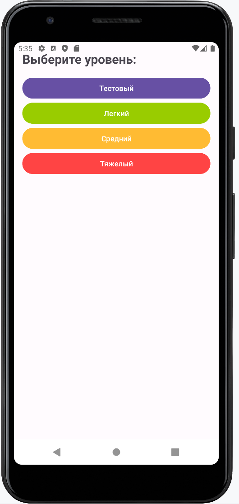
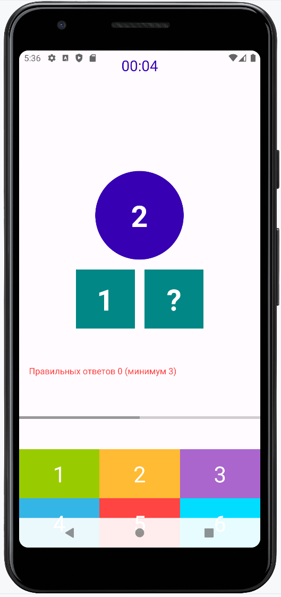

# Number's Game
## A game for kids to learn simple number counting skills
### by Wizand0

---

## About:

Number's Game is an educational game designed for children to develop their basic math skills in a playful and interactive way.

### Game Rules:
You will see three shapes: two at the bottom and one at the top. Two of these shapes will contain numbers. The task is to ensure that the sum of the numbers in the two bottom shapes equals the number in the top shape. To do this, you need to insert the missing number.

**Example:**
- The top circle contains the number 7.
- One of the bottom shapes has a question mark, and the other has the number 4.
- The missing number should be 3 because 3 + 4 = 7.

---

## О игре:

Number's Game — это обучающая игра, созданная для детей, чтобы развивать базовые навыки счета в игровой и интерактивной форме.

### Правила игры:
Перед вами будет три фигуры: две снизу и одна сверху. В двух из них будут числа. Необходимо, чтобы сумма чисел из двух нижних фигур была равна числу в верхней фигуре. Для этого нужно вставить недостающее число.

**Пример:**
- В верхнем круге число 7.
- В одном из нижних кругов знак вопроса, а в другом число 4.
- Значит, на месте вопросительного знака должно быть число 3, потому что 3 + 4 = 7.

---

## Functionality:

- Localization (Ru; En)

---

## Screenshots

The following screenshots illustrate key parts of the application:

|              Main screen              |             Settings View             |  
|:-------------------------------------:|:-------------------------------------:|  
|  |  |  

|                 Game                  |              Dark Theme               |  
|:-------------------------------------:|:-------------------------------------:|  
|  |  |  

---

## TODO

- Add new levels with increasing difficulty.
- Include hints to help younger players.
- Add sound effects and animations for better engagement.

---

## Very long-term TODO

- Implement multiplayer mode for cooperative play.
- Add a leaderboard system to track scores and progress.

---

## Skills

- Kotlin

---

## Versions

- **v1.0:** Initial release with basic functionality.

---

## Useful resources

- [Kotlin Documentation](https://kotlinlang.org/docs/reference/)  
